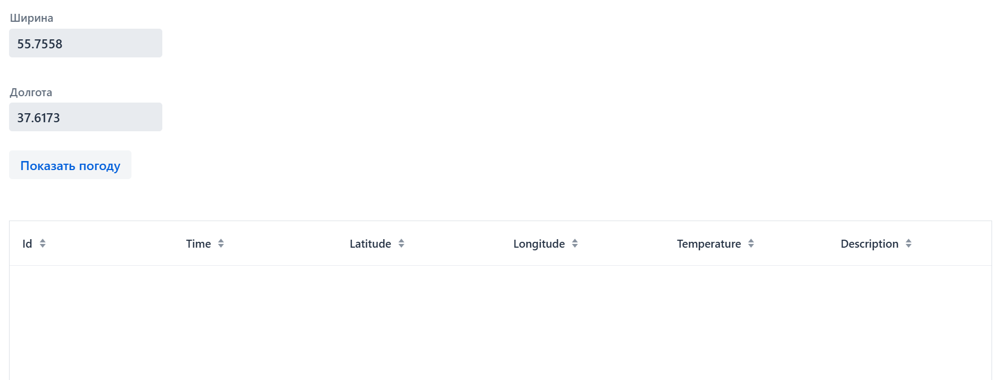
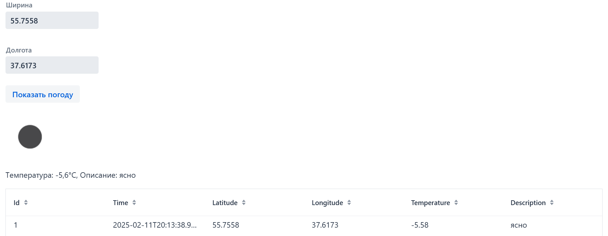
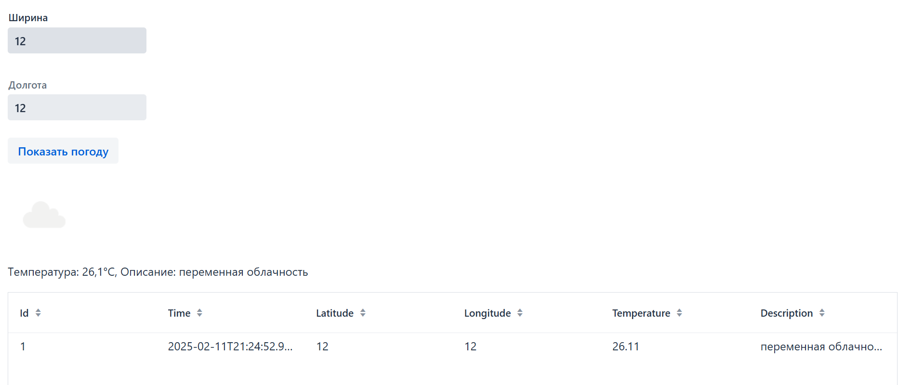
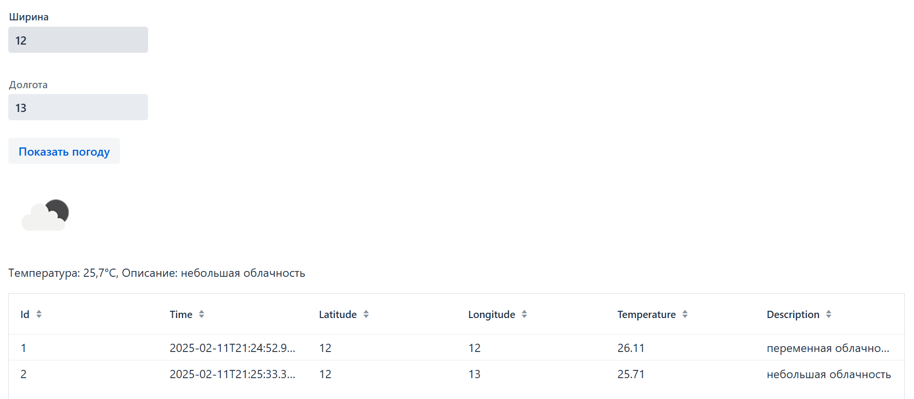
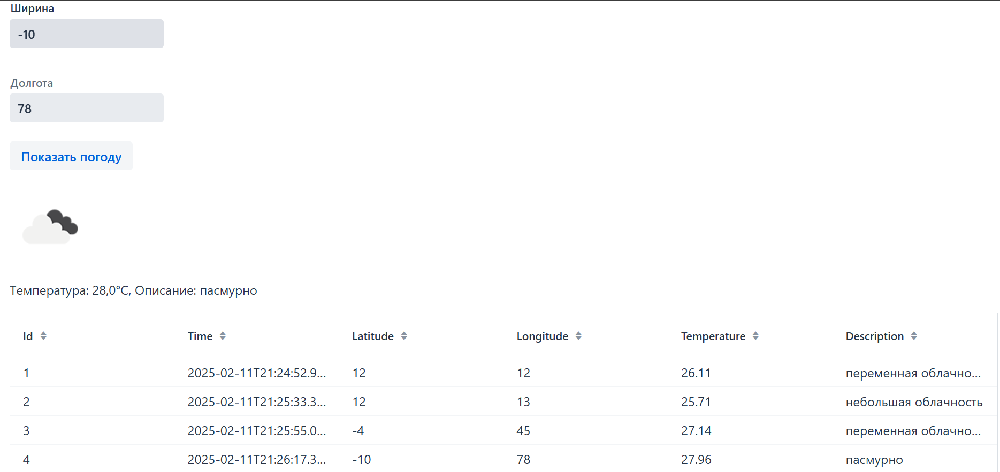

Визуализатор погоды
======

Способы запуска приложения
---

1. Можно запустить программу через IDE при помощи кнопки "Run"
(перед запуском необходимо в resources/application.properties в строке weather.api-key=WEATHER_API_KEY
внести действительный ключ, иначе программа выдаст ошибку 401)

2. Запуск готового джарника через команду:

    ```
    java -jar target/WeatherApp-0.0.1-SNAPSHOT.jar
    ```

Приложение работает по адресу ```http://localhost:8080/```

Скриншоты с примерами работы программы
---

1. Экран при первой загрузке





2. Экран после введённого запроса


3. Экран после введённого запроса


4. Пример сохранения истории запросов в таблице


5. Пример сохранения истории запросов в таблице



 
